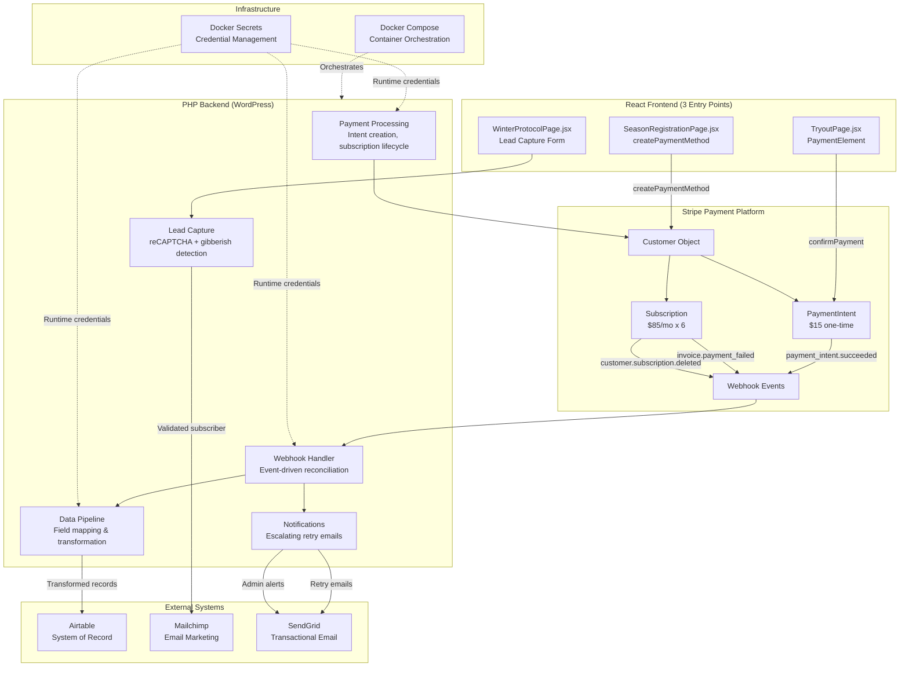

# Stripe Financial Integration & Data Pipeline

**End-to-end payment processing system handling live transactions, subscription billing, webhook reconciliation, lead capture automation, and financial data management — built for a real sports organization.**

---

## What This System Does

This system processes three distinct transaction types — one-time fees, recurring subscriptions, and lead captures — across a unified payment infrastructure. When a payment succeeds, the system automatically confirms it, records it in the financial database, and routes the data to the appropriate downstream systems. When a payment fails, automated retry notifications escalate from casual reminders to urgent alerts. Lead capture forms qualify prospects through anti-spam validation and route them into the marketing pipeline with acquisition channel tracking.

No manual data entry. Every dollar that moves through Stripe is accounted for in the system of record.

---

## The Three Revenue & Lead Flows

### Flow 1: Tryout Registration — $15 One-Time Payment

**What it does:** Collects a flat $15 tryout fee via Stripe PaymentIntent.

**Finance language:** One-time receivable with immediate revenue recognition. Payment confirmed via webhook event, creating a verified record in the financial database.

**Technical flow:**
1. React `PaymentElement` collects card details
2. Frontend calls `elements.submit()` → `stripe.confirmPayment()`
3. PHP backend creates PaymentIntent via Stripe API (`/v1/payment_intents`)
4. Stripe webhook (`payment_intent.succeeded`) confirms payment
5. Airtable record created with Stripe Payment ID for audit trail
6. Player added to Mailchimp with "Tryout Registration" tag
7. Admin notification email sent with payment details

**Data captured:** Name, email, phone, DOB, position, experience level, tryout date, Stripe Payment Intent ID

**Source code:** [`payment-processing/payment-intents.php`](payment-processing/payment-intents.php) | [`data-pipeline/airtable-tryout.php`](data-pipeline/airtable-tryout.php) | [`frontend/TryoutPage.jsx`](frontend/TryoutPage.jsx)

---

### Flow 2: Season Registration — $510 Full / $85/mo Subscription

**What it does:** Handles two payment paths — pay-in-full ($510 one-time) or 6-month subscription ($85/mo with auto-cancel). Four pricing tiers based on player type and name personalization:

| Tier | Monthly | Full Payment |
|------|---------|-------------|
| Full Season | $85/mo | $510 |
| Full Season + Personalization | $98/mo | $510 (personalization included free) |
| Guest (3-5 games) | $42/mo | $252 |
| Guest + Personalization | $55/mo | $252 (personalization included free) |

**Finance language:** Deferred revenue for subscriptions (recognized monthly over 6-month billing period), full recognition for lump-sum payments. Tracks payment status (Paid/Pending), payment frequency, and customer lifecycle. Failed subscription payments trigger escalating retry notifications (attempt 1, 2, 3+ with different messaging and urgency levels).

**Technical flow:**
1. React form collects player info + equipment sizes
2. Frontend calls `stripe.createPaymentMethod()` with billing details
3. PHP creates Stripe Customer → attaches PaymentMethod → creates PaymentIntent (full) or Subscription (monthly)
4. 3D Secure handling via `requires_action` response + `confirmCardPayment()`
5. Airtable record created with field-level data transformation:
   - Socks size mapping: `'S'` → `'S (US 5-7)'`
   - Payment status normalization: `'full'` → `'Paid'`, `'monthly'` → `'Pending'`
   - Payment frequency: `'full'` → `'Paid in full'` (case-sensitive match)
6. Admin email notification with full player details, equipment sizes, and payment info
7. Player added to Mailchimp with tier-specific tags

**Data captured:** Name, email, age, position, tracksuit/jersey/shorts/socks sizes, name personalization preference, waiver agreement, payment method, Stripe Customer ID, Subscription/Payment Intent ID

**Source code:** [`payment-processing/subscription-lifecycle.php`](payment-processing/subscription-lifecycle.php) | [`payment-processing/payment-intents.php`](payment-processing/payment-intents.php) | [`data-pipeline/airtable-registration.php`](data-pipeline/airtable-registration.php) | [`data-pipeline/field-mapping.php`](data-pipeline/field-mapping.php) | [`frontend/SeasonRegistrationPage.jsx`](frontend/SeasonRegistrationPage.jsx)

---

### Flow 3: Winter Protocol Free Guide — Lead Capture ($0)

**What it does:** Captures leads through a free training guide download. No payment, but drives the marketing funnel by converting website visitors into qualified leads for future season registration revenue.

**Finance language:** Lead acquisition cost = $0. Converts prospects into qualified leads with full acquisition channel tracking (Instagram, TikTok, Facebook, YouTube, Google, referral). Tracks first touch to enable marketing ROI analysis when leads convert to paying members.

**Technical flow:**
1. React form with reCAPTCHA verification collects name, email, traffic source
2. PHP validates input + runs anti-spam gibberish detection algorithm
3. Gibberish submissions silently rejected (fake success response to avoid revealing detection logic)
4. Valid submissions routed to Mailchimp API with "Winter Protocol Insider Club" tag and traffic source merge field
5. Guide delivered via email automation

**Data captured:** Name, email, traffic source (how they heard about us)

**Source code:** [`lead-capture/winter-protocol-handler.php`](lead-capture/winter-protocol-handler.php) | [`lead-capture/spam-detection.php`](lead-capture/spam-detection.php) | [`notifications/mailchimp-integration.php`](notifications/mailchimp-integration.php) | [`frontend/WinterProtocolPage.jsx`](frontend/WinterProtocolPage.jsx)

---

## Architecture



See [`docs/architecture.md`](docs/architecture.md) for detailed flow diagrams of each transaction type.

---

## The Finance Side — What I Built

### Payment Reconciliation
Every Stripe transaction is matched against the database via webhook events. When `payment_intent.succeeded` fires, the system creates the corresponding record in Airtable. When `invoice.payment_failed` fires, the status is updated and retry notifications begin. No payment exists in Stripe without a matching record in the system of record.

### Subscription Billing
6-month recurring billing with automatic cancellation (`cancel_at` timestamp). Four pricing tiers based on player type (Full Season/Guest) and name personalization add-on. Tracks payment status (Paid, Pending), frequency (Monthly, Paid in full), and customer lifecycle through the Stripe Customer object.

### Data Integrity Controls
Field-level validation ensures data flowing from the payment platform matches the system of record's expected format. The data transformation layer maps:
- Payment status codes to GL-compatible values (`'full'` → `'Paid'`)
- Raw form values to select field options (`'S'` → `'S (US 5-7)'`)
- Case-sensitive frequency labels (`'Paid in full'` not `'Paid in Full'`)

### Audit Trail
Every transaction includes: Stripe Payment Intent ID, Customer ID, Subscription ID, registration timestamp, payment amount, and payment status. Full traceability from payment to database record.

### Internal Controls
- Nonce verification on every AJAX endpoint (CSRF protection)
- Webhook signature validation (`\Stripe\Webhook::constructEvent`)
- Secrets management through Docker (no credentials in code or environment variables)
- Admin-only access on payment tools dashboard

### Lead-to-Revenue Pipeline
Free guide captures lead data and acquisition channel, feeding the marketing system. Tags segment contacts by engagement level (free lead vs. paid member vs. season registrant). Converts $0 leads into future season registrations — trackable from first touch to payment.

### Anti-Fraud Controls
Custom gibberish detection algorithm analyzes consonant-to-vowel ratios and character patterns to silently reject spam submissions. Returns fake success responses to prevent bots from reverse-engineering the detection logic through trial and error.

---

## The Technical Side — How I Built It

### Stripe API
PaymentIntents for one-time charges, Subscriptions with `cancel_at` for fixed-term billing, Customer objects linking payments to people, Payment Methods with `createPaymentMethod()` flow, 3D Secure handling via `requires_action` + `confirmCardPayment()`, and webhook event processing for async payment confirmation.

### Data Pipeline
PHP backend validates, transforms, and routes payment data to Airtable via REST API. Field mapping layer ensures form values match database schema exactly — the fix for the original 422 errors that caused silent write failures.

### Lead Capture
reCAPTCHA verification + custom gibberish detection (consonant/vowel ratio analysis, pattern matching) → Mailchimp subscriber API with tagging and traffic source merge fields.

### React Frontend
Three React applications compiled via Webpack into separate bundles:
- **TryoutPage** — Stripe PaymentElement for $15 one-time payment
- **SeasonRegistrationPage** — `createPaymentMethod` flow with subscription/full payment toggle, 4-tier pricing, equipment size selection, waiver agreement
- **WinterProtocolPage** — Lead capture form with reCAPTCHA, traffic source tracking

### Webpack
4 entry points compiled into separate bundles (homepage, tryout, seasonRegistration, winter-protocol), each mounting an independent React app.

### Docker
Containerized deployment with Docker Compose. All credentials managed via Docker secrets (`/run/secrets/*`) — the most secure approach for containerized applications. No passwords in environment variables or code.

### Webhook Architecture
Event-driven reconciliation processing these Stripe events:
- `payment_intent.succeeded` — Confirms tryout payment, creates database record
- `invoice.payment_failed` — Triggers escalating email sequence, updates status
- `customer.subscription.deleted` — Marks subscription as ended in database

### Email Marketing
Mailchimp API integration with subscriber creation, tag-based segmentation, merge field population, and idempotent tag updates for existing members.

---

## Real-World Problem I Solved

### The Finance Version
Payment confirmations were succeeding in Stripe but not reaching the financial database. Root cause: field mapping mismatches between the payment platform and the system of record were causing silent write failures. The season registration table was completely empty despite successful payments — a reconciliation gap where revenue was collected but not recorded.

Additionally, Stripe flagged missing redirect parameters that could cause future payment failures for customers requiring 3D Secure authentication.

### The Technical Version
Airtable API returned 422 errors because select field values didn't match the table schema:
- `'Paid in Full'` vs `'Paid in full'` (case mismatch)
- `'S'` vs `'S (US 5-7)'` (socks size abbreviation vs full label)

Fixed by implementing a data transformation layer ([`data-pipeline/field-mapping.php`](data-pipeline/field-mapping.php)) that maps every form value to its exact Airtable schema equivalent before posting.

Also added `return_url` to PaymentIntent confirmation to comply with Stripe's 3DS requirements — without it, customers with 3D Secure-enabled cards would see payment failures.

---

## Tech Stack

| Layer | Technology |
|-------|-----------|
| Payment Processing | Stripe API (PaymentIntents, Subscriptions, Customers, Webhooks) |
| Financial Database | Airtable API (REST) |
| Backend | PHP (WordPress custom theme) |
| Frontend | React (3 independent apps) |
| Build | Webpack (4 entry points) |
| Email Marketing | Mailchimp API |
| Transactional Email | SendGrid (SMTP) |
| Anti-Spam | Google reCAPTCHA + Custom gibberish detection |
| Infrastructure | Docker + Docker Compose |
| Secrets Management | Docker Secrets |

---

## Deployed At

This system is live at [newteamfc.com](https://newteamfc.com), processing real payments for Newteam FC, a competitive soccer organization in Massachusetts.

---

## Repository Structure

```
stripe-financial-integration/
├── README.md                              # This file
├── docs/
│   └── architecture.md                    # Detailed flow diagrams (Mermaid)
├── payment-processing/
│   ├── payment-intents.php                # One-time payment creation & confirmation
│   ├── subscription-lifecycle.php         # Subscription create, monitor, cancel
│   ├── webhook-handler.php                # Event processing & reconciliation
│   └── customer-management.php            # Customer creation & portal management
├── data-pipeline/
│   ├── airtable-registration.php          # Season registration → system of record
│   ├── airtable-tryout.php                # Tryout registration → system of record
│   └── field-mapping.php                  # Data transformation & validation logic
├── lead-capture/
│   ├── winter-protocol-handler.php        # Lead magnet signup processing
│   └── spam-detection.php                 # Anti-fraud gibberish detection
├── notifications/
│   ├── payment-failure-emails.php         # Escalating retry email templates
│   ├── admin-notifications.php            # Internal alerts on payment events
│   └── mailchimp-integration.php          # Email marketing automation & tagging
├── frontend/
│   ├── SeasonRegistrationPage.jsx         # React payment form (subscription + one-time)
│   ├── TryoutPage.jsx                     # React payment form (one-time)
│   └── WinterProtocolPage.jsx             # React lead capture form
├── deployment/
│   ├── docker-compose.yml                 # Container orchestration
│   └── environment.example                # Required env vars (no secrets)
└── admin/
    └── payment-tools.php                  # Admin dashboard for payment ops
```
