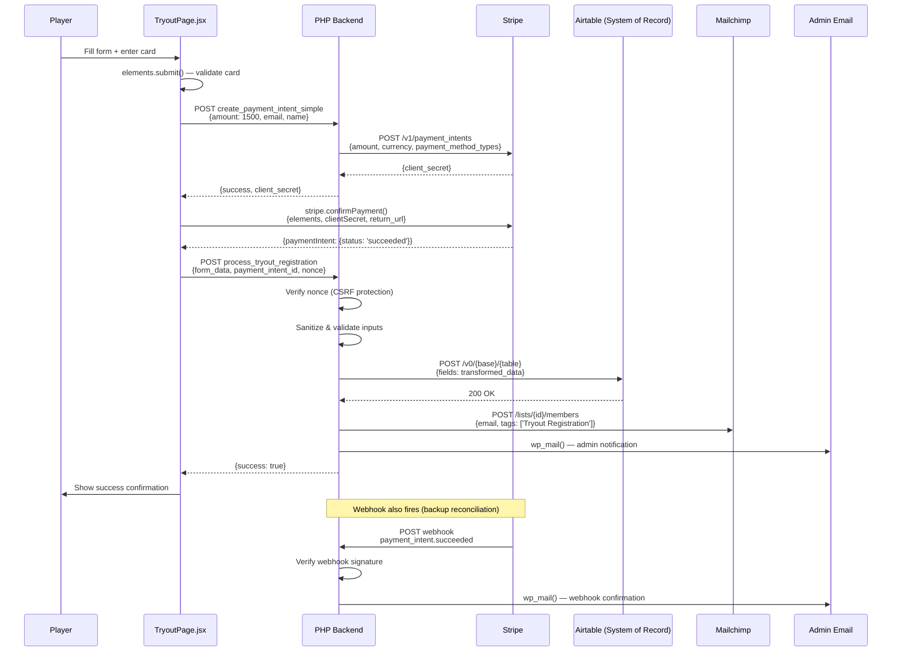
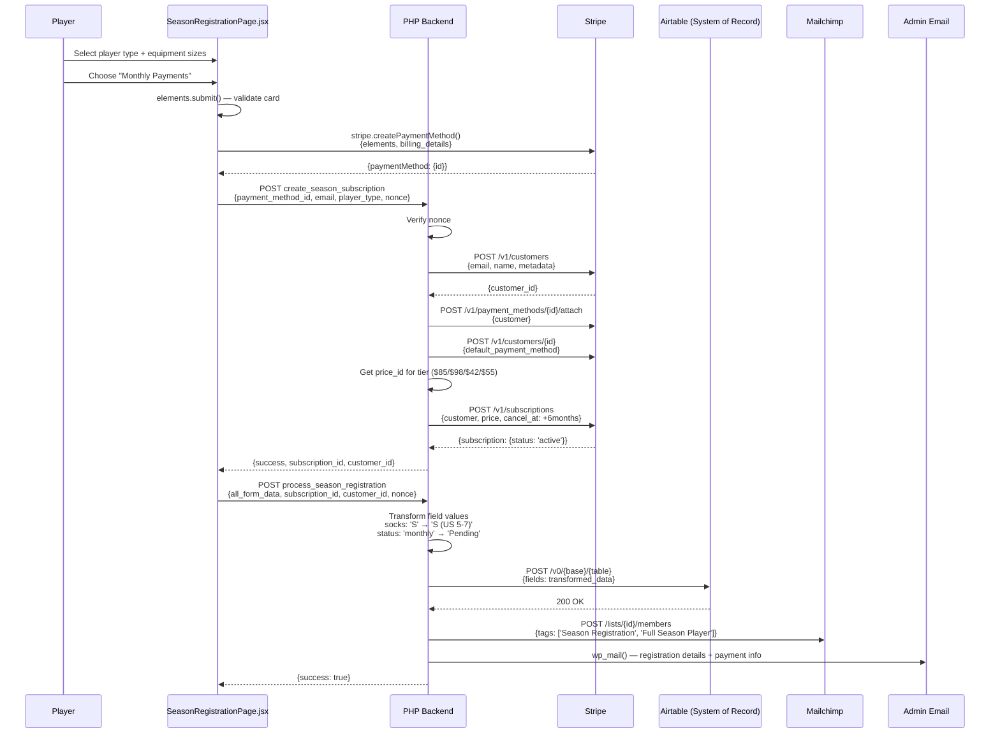
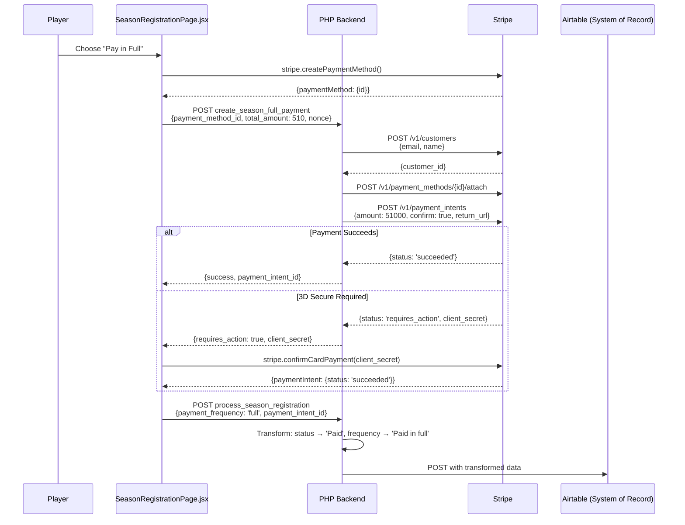
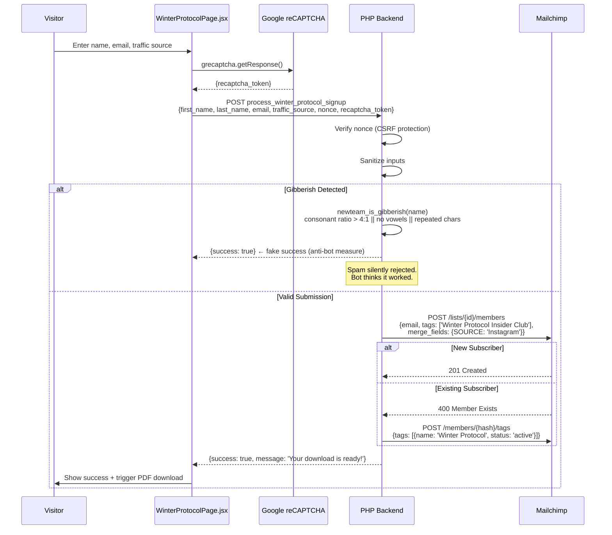
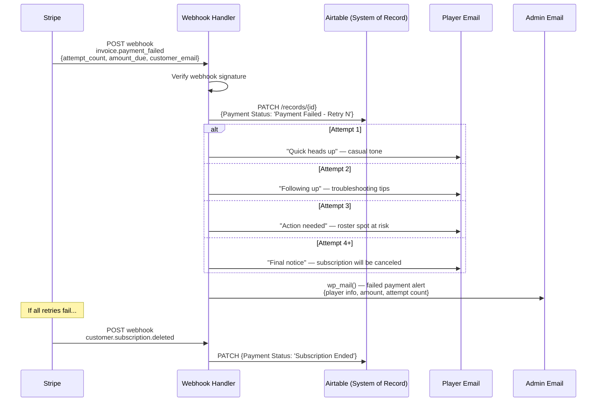
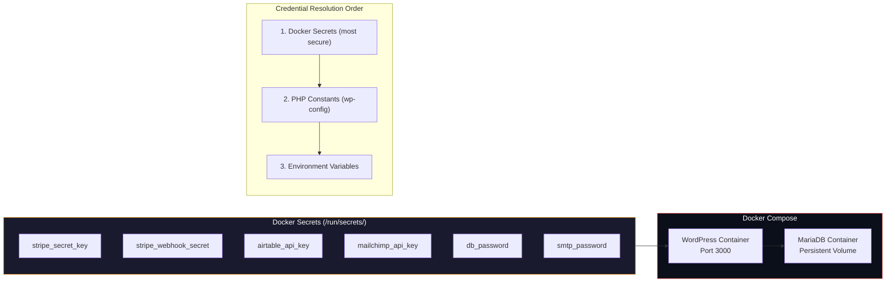

# System Architecture

Detailed flow diagrams for each transaction type in the Stripe Financial Integration system.

---

## Flow 1: Tryout Registration ($15 One-Time Payment)

---

## Flow 2: Season Registration — Monthly Subscription ($85/mo)

---

## Flow 2b: Season Registration — Pay in Full ($510)

---

## Flow 3: Winter Protocol Lead Capture ($0)

---

## Failed Payment Recovery Flow

---

## Infrastructure & Secrets Management

---

## Data Transformation Layer

The field mapping layer sits between the payment platform and the database, ensuring every value matches the exact schema:

| Source (Form/Stripe) | Transformation | Target (Airtable) |
|---------------------|----------------|-------------------|
| `'S'` | Socks size mapping | `'S (US 5-7)'` |
| `'M'` | Socks size mapping | `'M (US 7-9)'` |
| `'L'` | Socks size mapping | `'L (US 9-12)'` |
| `'XL'` | Socks size mapping | `'XL (US 12+)'` |
| `'full'` | Payment status | `'Paid'` |
| `'monthly'` | Payment status | `'Pending'` |
| `'full'` | Payment frequency | `'Paid in full'` |
| `'monthly'` | Payment frequency | `'Monthly'` |
| `'goalkeeper'` | Position normalization | `'Goalkeeper'` |
| `'high_school'` | Experience normalization | `'High School'` |
| `'semi_pro'` | Experience normalization | `'Semi-Professional'` |
| `'guest'` | Player type label | `'Guest Player'` |
| `'full_season'` | Player type label | `'Full Season Player'` |

Without these transformations, Airtable returns `422 INVALID_VALUE_FOR_COLUMN` and the record is never created — payments succeed but the financial database stays empty.

See [`data-pipeline/field-mapping.php`](../data-pipeline/field-mapping.php) for the implementation.
